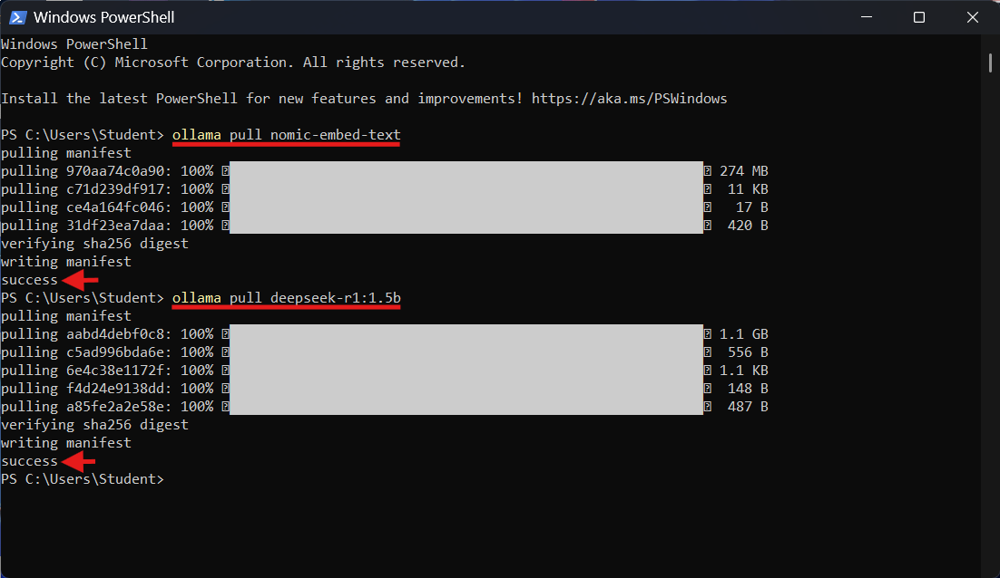
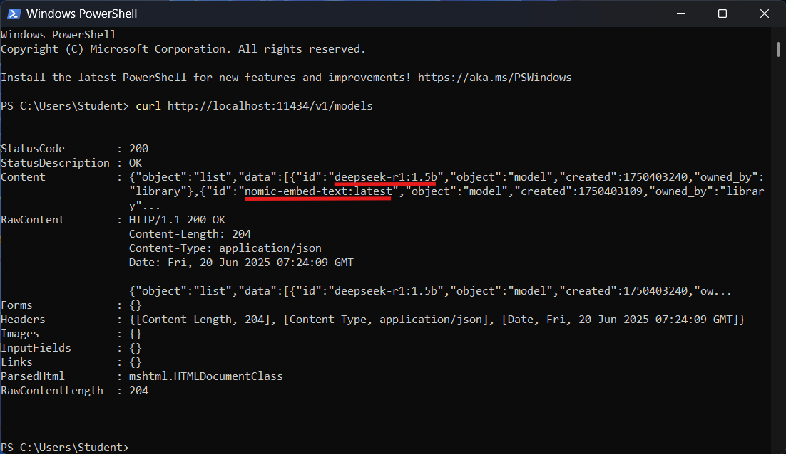
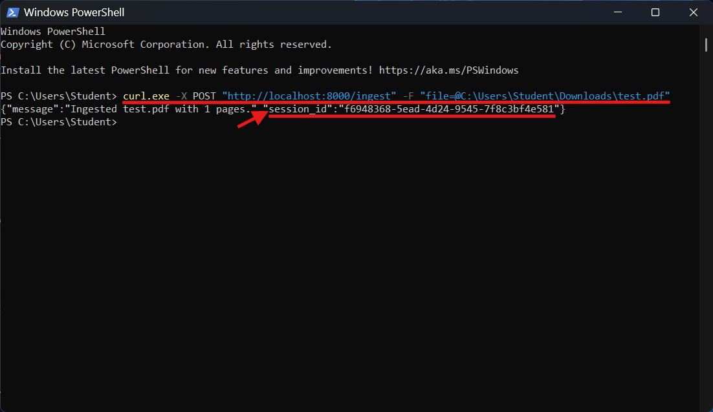
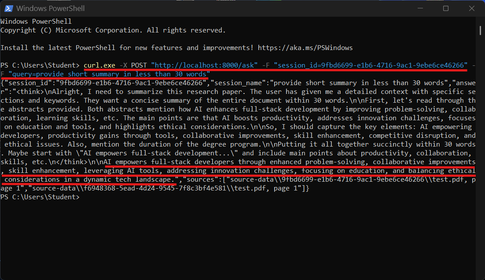
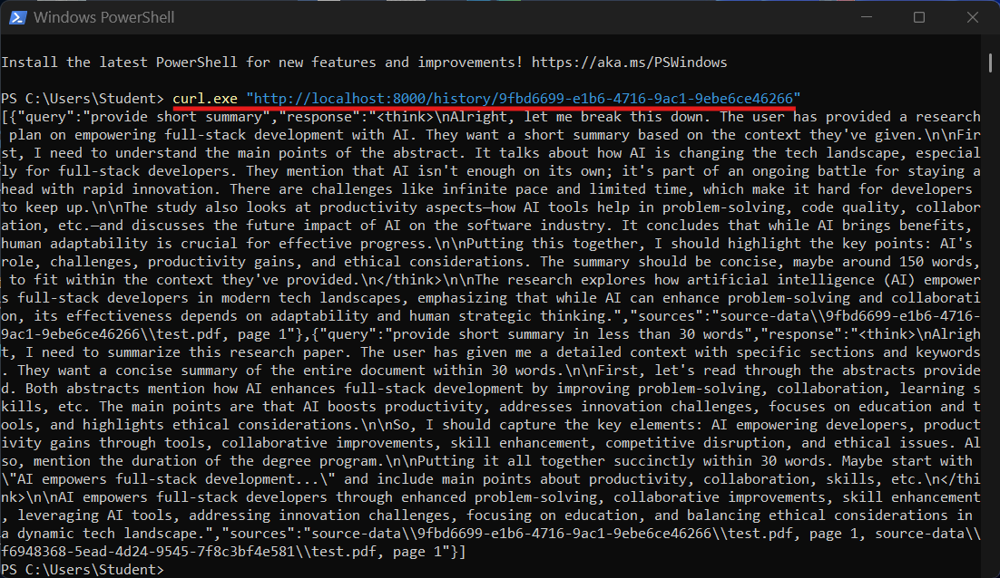
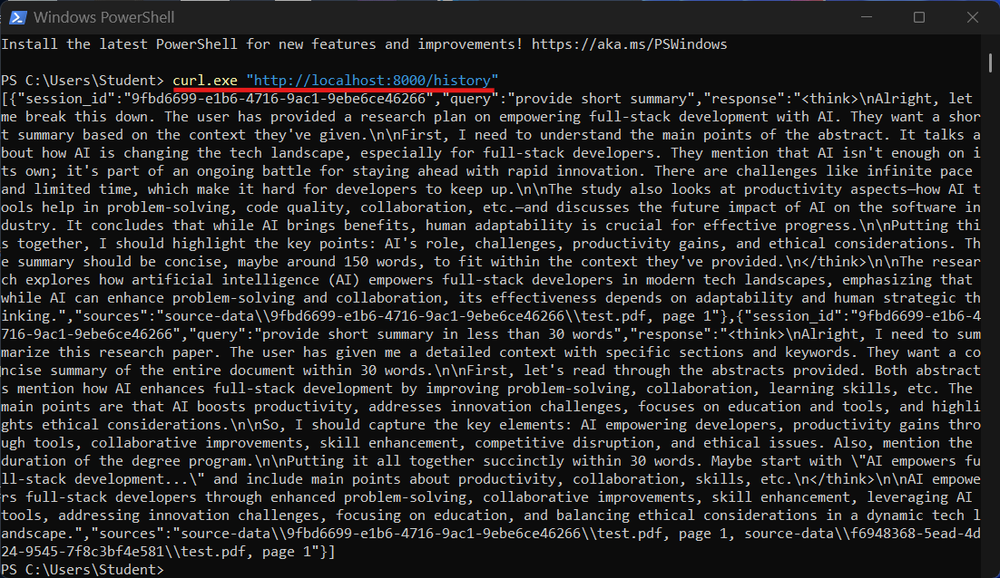
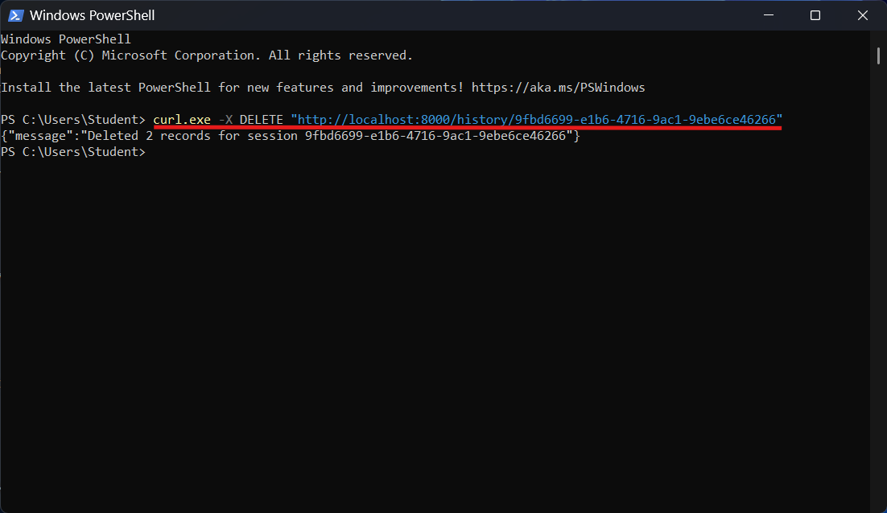
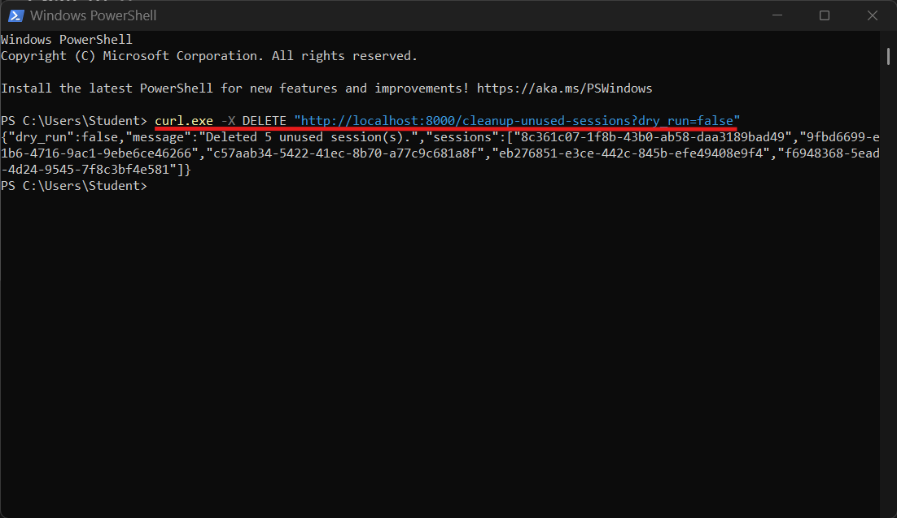

# 🤖 Local AI Powered RAG System with PDF Ingestion using Ollama LlamaIndex ChromaDB and SQLite

This project implements a **Retrieval-Augmented Generation (RAG)** system designed to process and query PDF documents using a combination of document ingestion, vector-based retrieval, and language model-based question answering. The system is built using **FastAPI** for the API, **Ollama** for embeddings and language model inference, **ChromaDB** for vector storage, and **SQLite** for chat history persistence.

# 📚 Table of Contents

1. [🤖 Project Title](#-local-ai-powered-rag-system-with-pdf-ingestion-using-ollama-llamaindex-chromadb-and-sqlite)  
2. [🧭 System Overview](#-system-overview)  
3. [✨ Key Features](#-key-features)  
4. [🧩 Feature Details](#-features)  
5. [🗂️ Project Structure](#-project-structure)  
6. [🛠️ Setup](#-setup)  
    - [📋 Prerequisites](#-prerequisites)  
    - [📦 Installation](#-installation)  
    - [🚀 Running the App](#-running-the-app)  
7. [📡 Usage](#-usage)  
    - [📥 POST `/ingest`](#-post-ingest)  
    - [❓ POST `/ask`](#-post-ask)  
    - [📚 GET `/history/{session_id}`](#-get-historysession_id)  
    - [🗃️ GET `/history`](#-get-history)  
    - [❌ DELETE `/history/{session_id}`](#-delete-historysession_id)  
    - [🧹 DELETE `/cleanup-unused-sessions`](#-delete-cleanup-unused-sessions)

## 🧭 System Overview

A modular, production-quality Retrieval-Augmented Generation system using:

- **Ollama** (local LLM + embeddings)
- **LlamaIndex** for document handling and querying
- **FastAPI** backend for integration
- **PyMuPDF** for PDF ingestion
- **ChromaDB** as the vector database
- **SQLite** for session management

---

## ✨ Key Features

- **PDF Ingestion**: Supports uploading and processing PDF files.
- **Duplicate Detection**: Prevents re-ingestion of the same files using file-level hashes.
- **Query Engine**: Answers user queries based on ingested documents.
- **Chat History Management**: Stores and retrieves chat sessions with session IDs.
- **Logging**: Comprehensive logging for debugging and monitoring.

---

## 🧩 Features

- 📄 PDF ingestion with metadata (filename, page number)
- 🧠 Embedding with Ollama embeddings, stored in ChromaDB via LlamaIndex
- 🚫 Deduplication based on SHA256 hash of PDF text chunks
- 🔍 Retrieval of relevant document chunks with citations
- 💬 Session-based chat history stored in SQLite
- 🧹 Cleanup of unused sessions and storage
- 🚀 FastAPI API endpoints:
  - `POST /ingest` — Ingest a PDF file into the vector store
  - `POST /ask` — Query documents in a session with response + sources
  - `GET /history/{session_id}` — Retrieve chat history for a specific session
  - `GET /history` — Retrieve chat history across all sessions
  - `DELETE /history/{session_id}` — Delete all chat history for a session
  - `DELETE /cleanup-unused-sessions` — Remove unused session folders and DB records (with `dry_run` support)

---

## 🗂️ Project Structure

```text
/                                  # Project root directory
├── src/                           # Main application package
│   ├── api/                       # API server (e.g., FastAPI/Flask app)
│   │   └── app.py                 # Main API entry point
│   ├── chat/                      # Handles chat session logic
│   │   └── session_store.py       # Manages chat session persistence
│   ├── cli/                       # Command-line interface tools
│   │   └── ingest.py              # CLI script for data ingestion
│   ├── config/                    # Configuration management
│   │   ├── app_settings.py        # Application settings and environment config
│   │   └── logging_config.py      # Logging setup (e.g., rotating file handler)
│   ├── embedding/                 # Embedding generation logic
│   │   └── ollama_embedder.py     # Embedding logic using Ollama
│   ├── ingestion/                 # Document ingestion and preprocessing
│   │   └── pdf_loader.py          # Loader and parser for PDF documents
│   ├── llm/                       # LLM (Large Language Model) interaction
│   │   └── ollama_llm.py          # Interface for interacting with Ollama LLM
│   ├── retrieval/                 # Information retrieval layer
│   │   └── query_engine.py        # Executes semantic search queries
│   ├── vectorstore/               # Vector database integration
│   │   └── index_manager.py       # Manages vector index creation and access
├── source-data/                   # (Generated) Uploaded and processed PDF files
├── chroma_db/                     # (Generated) ChromaDB vector store directory
├── chat_history.db                # (Generated) SQLite database for chat logs
├── logs/                          # (Generated) Logging output directory
│   └── 202506.log                 # Log file (format: YYYMM) for application runtime
├── requirements.txt               # Python dependency list
├── README.md                      # Project overview and usage instructions
├── pyproject.toml                 # Build system configuration and metadata
├── LICENSE                        # Software license
├── .gitignore                     # Git version control ignore rules
├── .env                           # Environment variable definitions (e.g., API keys)
```

## 🛠️ Setup

### 📋 Prerequisites

- Install [Python](https://www.python.org/downloads/)
- Install [Ollama](https://ollama.com/download/windows)
   - Pull [nomic-embed-text](https://ollama.com/library/nomic-embed-text)
      ```powershell
      ollama pull nomic-embed-text
      ```
   - Pull [deepseek-r1:1.5b](https://ollama.com/library/deepseek-r1:1.5b)
      ```powershell
      ollama pull deepseek-r1:1.5b
      ```
    

### 📦 Installation

1. **Clone repository**

    ```bash
    git clone https://github.com/ahmad-act/Local-AI-Powered-RAG-System-with-PDF-Ingestion-using-Ollama-LlamaIndex-ChromaDB-and-SQLite.git
    cd Local-AI-Powered-RAG-System-with-PDF-Ingestion-using-Ollama-LlamaIndex-ChromaDB-and-SQLite
    ```

2. **Create and activate virtual environment**

    ```powershell
    python -m venv venv
    .\venv\Scripts\Activate.ps1
    ```

3. **Install dependencies**

    ```powershell
    pip install -r requirements.txt
    ```

4. **Setup environment variables**

    Copy .env.example to .env and adjust as needed.

    Example .env:

    ```env
    EMBED_MODEL=nomic-embed-text
    QA_MODEL=deepseek-r1:1.5b
    OLLAMA_BASE_URL=http://localhost:11434
    CHROMA_DB=./chroma_db
    SESSION_DB=sqlite:///chat_history.db
    ```

### 🚀 Running the App

1. **Start Ollama Server**

   Run Ollama locally (ensure the server listens on the default port `11434`):

   ```bash
   ollama serve
   ```

    This starts the Ollama server accessible at:

    ```poweshell
    http://localhost:11434
    ```
2. **Verify Ollama is running**

   You can test with a simple curl request:

   ```powershell
   curl http://localhost:11434/v1/models
   ```

   You should see the list of available models.
   

2. **Run FastAPI Server**

   ```bash
   uvicorn src.api.app:app --host 0.0.0.0 --port 8000 --reload
   ```

## 📡 Usage

### API Endpoints

---

#### 📥 POST `/ingest`

  Upload a PDF file to ingest:

  ```powershell
  curl.exe -X POST "http://localhost:8000/ingest" -F "file=@C:\Users\Student\Downloads\test.pdf"
  ```

  Response:

  ```json
  {
    "message":"Ingested test.pdf with 1 pages.",
    "session_id":"f6948368-5ead-4d24-9545-7f8c3bf4e581"
  }
```



---

#### ❓ POST `/ask`

  Query your ingested documents with session tracking:

  ```powershell
   curl.exe -X POST "http://localhost:8000/ask" -F "session_id=9fbd6699-e1b6-4716-9ac1-9ebe6ce46266" -F "query=provide short summary in less than 30 words"
  ```

  Response:

  ```json
  {
    "session_id":"9fbd6699-e1b6-4716-9ac1-9ebe6ce46266",
    "session_name":"provide short summary in less than 30 words",
    "answer":"<think>\nAlright, I need to summarize this research paper. The user has given me a detailed context with specific sections and keywords. They want a concise summary of the entire document within 30 words.\n\nFirst, let's read through the abstracts provided. Both abstracts mention how AI enhances full-stack development by improving problem-solving, collaboration, learning skills, etc. The main points are that AI boosts productivity, addresses innovation challenges, focuses on education and tools, and highlights ethical considerations.\n\nSo, I should capture the key elements: AI empowering developers, productivity gains through tools, collaborative improvements, skill enhancement, competitive disruption, and ethical issues. Also, mention the duration of the degree program.\n\nPutting it all together succinctly within 30 words. Maybe start with \"AI empowers full-stack development...\" and include main points about productivity, collaboration, skills, etc.\n</think>\n\nAI empowers full-stack developers through enhanced problem-solving, collaborative improvements, skill enhancement, leveraging AI tools, addressing innovation challenges, focusing on education, and balancing ethical considerations in a dynamic tech landscape.",
    "sources":[
      "source-data\\9fbd6699-e1b6-4716-9ac1-9ebe6ce46266\\test.pdf, page 1","source-data\\f6948368-5ead-4d24-9545-7f8c3bf4e581\\test.pdf, page 1"
    ]
  }
  ```

  

---

#### 📚 GET `/history/{session_id}`

  Retrieve full chat history for a specific session:

  ```powershell
  curl.exe "http://localhost:8000/history/9fbd6699-e1b6-4716-9ac1-9ebe6ce46266"
  ```

  Response:

  ```json
  [
    {
      "query":"provide short summary",
      "response":"<think>\nAlright, let me break this down. The user has provided a research plan on empowering full-stack development with AI. They want a short summary based on the context they've given.\n\nFirst, I need to understand the main points of the abstract. It talks about how AI is changing the tech landscape, especially for full-stack developers. They mention that AI isn't enough on its own; it's part of an ongoing battle for staying ahead with rapid innovation. There are challenges like infinite pace and limited time, which make it hard for developers to keep up.\n\nThe study also looks at productivity aspects—how AI tools help in problem-solving, code quality, collaboration, etc.—and discusses the future impact of AI on the software industry. It concludes that while AI brings benefits, human adaptability is crucial for effective progress.\n\nPutting this together, I should highlight the key points: AI's role, challenges, productivity gains, and ethical considerations. The summary should be concise, maybe around 150 words, to fit within the context they've provided.\n</think>\n\nThe research explores how artificial intelligence (AI) empowers full-stack developers in modern tech landscapes, emphasizing that while AI can enhance problem-solving and collaboration, its effectiveness depends on adaptability and human strategic thinking.",
      "sources":"source-data\\9fbd6699-e1b6-4716-9ac1-9ebe6ce46266\\test.pdf, page 1"
    },
    {
        "query":"provide short summary in less than 30 words",
        "response":"<think>\nAlright, I need to summarize this research paper. The user has given me a detailed context with specific sections and keywords. They want a concise summary of the entire document within 30 words.\n\nFirst, let's read through the abstracts provided. Both abstracts mention how AI enhances full-stack development by improving problem-solving, collaboration, learning skills, etc. The main points are that AI boosts productivity, addresses innovation challenges, focuses on education and tools, and highlights ethical considerations.\n\nSo, I should capture the key elements: AI empowering developers, productivity gains through tools, collaborative improvements, skill enhancement, competitive disruption, and ethical issues. Also, mention the duration of the degree program.\n\nPutting it all together succinctly within 30 words. Maybe start with \"AI empowers full-stack development...\" and include main points about productivity, collaboration, skills, etc.\n</think>\n\nAI empowers full-stack developers through enhanced problem-solving, collaborative improvements, skill enhancement, leveraging AI tools, addressing innovation challenges, focusing on education, and balancing ethical considerations in a dynamic tech landscape.",
        "sources":"source-data\\9fbd6699-e1b6-4716-9ac1-9ebe6ce46266\\test.pdf, page 1, source-data\\f6948368-5ead-4d24-9545-7f8c3bf4e581\\test.pdf, page 1"
    }
  ]
  ```

 

---

#### 🗃️ GET `/history`

  Retrieve all chat history across sessions:

  ```powershell
  curl.exe "http://localhost:8000/history"
  ```

  Response:

  ```json
  [
    {
      "session_id":"9fbd6699-e1b6-4716-9ac1-9ebe6ce46266",
      "query":"provide short summary",
      "response":"<think>\nAlright, let me break this down. The user has provided a research plan on empowering full-stack development with AI. They want a short summary based on the context they've given.\n\nFirst, I need to understand the main points of the abstract. It talks about how AI is changing the tech landscape, especially for full-stack developers. They mention that AI isn't enough on its own; it's part of an ongoing battle for staying ahead with rapid innovation. There are challenges like infinite pace and limited time, which make it hard for developers to keep up.\n\nThe study also looks at productivity aspects—how AI tools help in problem-solving, code quality, collaboration, etc.—and discusses the future impact of AI on the software industry. It concludes that while AI brings benefits, human adaptability is crucial for effective progress.\n\nPutting this together, I should highlight the key points: AI's role, challenges, productivity gains, and ethical considerations. The summary should be concise, maybe around 150 words, to fit within the context they've provided.\n</think>\n\nThe research explores how artificial intelligence (AI) empowers full-stack developers in modern tech landscapes, emphasizing that while AI can enhance problem-solving and collaboration, its effectiveness depends on adaptability and human strategic thinking.",
      "sources":"source-data\\9fbd6699-e1b6-4716-9ac1-9ebe6ce46266\\test.pdf, page 1"
    },
    {
        "session_id":"9fbd6699-e1b6-4716-9ac1-9ebe6ce46266",
        "query":"provide short summary in less than 30 words",
        "response":"<think>\nAlright, I need to summarize this research paper. The user has given me a detailed context with specific sections and keywords. They want a concise summary of the entire document within 30 words.\n\nFirst, let's read through the abstracts provided. Both abstracts mention how AI enhances full-stack development by improving problem-solving, collaboration, learning skills, etc. The main points are that AI boosts productivity, addresses innovation challenges, focuses on education and tools, and highlights ethical considerations.\n\nSo, I should capture the key elements: AI empowering developers, productivity gains through tools, collaborative improvements, skill enhancement, competitive disruption, and ethical issues. Also, mention the duration of the degree program.\n\nPutting it all together succinctly within 30 words. Maybe start with \"AI empowers full-stack development...\" and include main points about productivity, collaboration, skills, etc.\n</think>\n\nAI empowers full-stack developers through enhanced problem-solving, collaborative improvements, skill enhancement, leveraging AI tools, addressing innovation challenges, focusing on education, and balancing ethical considerations in a dynamic tech landscape.",
        "sources":"source-data\\9fbd6699-e1b6-4716-9ac1-9ebe6ce46266\\test.pdf, page 1, source-data\\f6948368-5ead-4d24-9545-7f8c3bf4e581\\test.pdf, page 1"
    }
  ]
  ```
  

---

#### ❌ DELETE `/history/{session_id}`

  Delete chat history for a specific session:

  ```powershell
  curl.exe -X DELETE "http://localhost:8000/history/9fbd6699-e1b6-4716-9ac1-9ebe6ce46266"
  ```

  Response:

  ```json
  {
    "message":"Deleted 2 records for session 9fbd6699-e1b6-4716-9ac1-9ebe6ce46266"
  }
  ```
  
  

---

#### 🧹 DELETE `/cleanup-unused-sessions`

  Clean up session folders that have no chat history (can be simulated with `dry_run=true`):

  ```powershell
  curl.exe -X DELETE "http://localhost:8000/cleanup-unused-sessions?dry_run=false"
  ```

  Response:

  ```json
  {
    "dry_run":false,
    "message":"Deleted 5 unused session(s).",
    "sessions":[
      "8c361c07-1f8b-43b0-ab58-daa3189bad49",
      "9fbd6699-e1b6-4716-9ac1-9ebe6ce46266",
      "c57aab34-5422-41ec-8b70-a77c9c681a8f",
      "eb276851-e3ce-442c-845b-efe49408e9f4",
      "f6948368-5ead-4d24-9545-7f8c3bf4e581"
    ]
  }
  ```

  

---